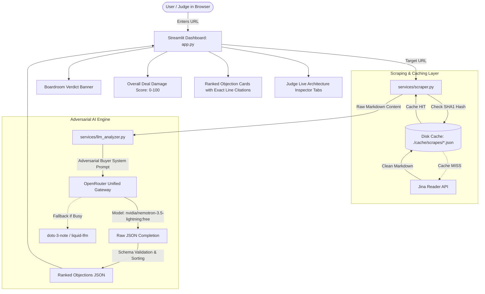

# 🧠 The Adversarial Buyer — Project Knowledge Base & Architecture Guide

> **Document Purpose:** This document serves as the single source of truth for developers, contributors, and AI coding assistants to understand the architecture, design principles, data contracts, and workflows of **The Adversarial Buyer**.

---

## 1. Executive Summary & Problem Statement

### 🎯 What is "The Adversarial Buyer"?
When SaaS companies sell software to enterprise organizations, deals are evaluated by a **hostile enterprise procurement committee** (CFO, CISO, VP of Engineering). Most enterprise deals are killed not in pitch meetings, but silently on the public pricing/packaging page due to opaque pricing, hidden minimums, security tax (gated SSO), or ambiguous SLAs.

**The Adversarial Buyer** is an autonomous AI agent that:
1. Scrapes any target SaaS pricing/landing page in real time.
2. Emulates a ruthless, skeptical corporate procurement committee.
3. Produces a strictly ranked list of lethal objections that Go-To-Market (GTM) teams cannot survive, tied directly to exact verbatim citations on the target website.
4. Provides concrete, actionable GTM survival fixes.

---

## 2. Architecture Diagram & End-to-End Data Flow



---

## 3. Directory & File Structure

```text
adversarial-buyer/
│
├── app.py                     # Main Streamlit web application & high-contrast UI
├── knowledge_base.md          # Comprehensive architecture & engineering guide (this file)
├── requirements.txt           # Project dependencies (httpx, streamlit, dotenv, etc.)
├── .env                       # Environment configuration (OPENROUTER_API_KEY)
├── .gitignore                 # Excludes .env, cache/, and Python artifacts
├── test_scraper.py            # Automated test suite for Jina scraper & disk cache
├── test_llm.py                # Automated benchmark suite for OpenRouter LLMs
│
├── services/
│   ├── scraper.py             # Jina Reader web scraper with SHA1 disk caching & retries
│   └── llm_analyzer.py        # OpenRouter pure-httpx client with adversarial prompting
│
└── cache/
    └── scrapes/               # Persisted JSON cache of scraped web pages ({sha1}.json)
```

---

## 4. Key Components Deep Dive

### 4.1. Web Scraper (`services/scraper.py`)
- **Engine:** Jina Reader (`https://r.jina.ai/{url}`).
- **Return Type:** Clean, plain-text Markdown.
- **Caching Mechanism:** Generates a SHA-1 hash of the URL (`hashlib.sha1(url.encode()).hexdigest()`) and writes payload to `./cache/scrapes/{hash}.json`.
- **Cache Payload Structure:**
  ```json
  {
    "url": "https://example.com/pricing",
    "fetched_at": "2026-08-22T07:16:41.979040+00:00",
    "content": "Title: Example..."
  }
  ```
- **Resilience:** 30-second timeout with automatic 1-time retry on failure (2s backoff).

### 4.2. Adversarial LLM Engine (`services/llm_analyzer.py`)
- **API Provider:** [OpenRouter](https://openrouter.ai) (`https://openrouter.ai/api/v1/chat/completions`).
- **Implementation:** Pure `httpx` (no proprietary SDK lock-in).
- **Default Active Model:** `nvidia/nemotron-3.5-lightning:free` (Fast 1M context model).
- **Fallback Models:** `dots-studio/dots-3-note-preview:free`, `liquid/lfm-2.5-2.6b:free`.
- **Adversarial Personas Simulated:**
  1. **The Skeptical CFO:** Attacking opaque ROI, hidden annual minimums, unit economics.
  2. **The Paranoid CISO:** Attacking gated SSO/SAML, missing SOC2/HIPAA certifications, audit log retention limits.
  3. **The Battle-Hardened VP of Engineering:** Attacking vague "fair-use" throttles, uncommitted SLAs, Beta features in core infrastructure.

### 4.3. Data Contract / Output JSON Schema
```json
{
  "deal_verdict": "DEAL REJECTED",
  "overall_damage_score": 96,
  "deal_killer_headline": "Included quotas are too low and log retention violates SOC2 compliance.",
  "ranked_objections": [
    {
      "rank": 1,
      "rank_badge": "LETHAL DEAL KILLER",
      "persona": "Chief Information Security Officer (CISO)",
      "domain": "Security & Compliance",
      "severity_score": 95,
      "trigger_line": "[Runtime Logs] 1 hour of logs",
      "gtm_vulnerability": "Sales cannot defend 1-hour log retention against enterprise 90-day compliance audits.",
      "lethal_objection": "1 hour of logs creates a compliance blind spot for forensic audits.",
      "gtm_survival_fix": "Disclose minimum 30-to-90 day log retention standards on the pricing page."
    }
  ]
}
```

### 4.4. Frontend UI (`app.py`)
- **Framework:** Streamlit (Wide Layout, High-Contrast Dark Theme).
- **Visual Elements:**
  - **Verdict Banner:** Color-coded Boardroom stamp (`DEAL REJECTED` in red / `DEAL AT RISK` in amber).
  - **Top Metric:** Overall Deal Damage Score (0-100) with delta win-rate penalty.
  - **Ranked Container Cards:** Left column with Persona/Badge/Score; Right column with Exact Trigger Line (`st.error`), Lethal Objection, GTM Vulnerability, and Survival Fix (`st.success`).
  - **Live Architecture Inspector (Tabs):**
    - `Tab 1: Scraped Clean DOM`: Displays raw Jina extract and disk cache key.
    - `Tab 2: LLM Prompt & Raw JSON`: Full JSON tree output directly from the LLM.
    - `Tab 3: Executive Markdown Brief`: One-click copyable markdown memo.

---

## 5. Local Setup & Execution Guide

### Prerequisites
- Python 3.10+
- OpenRouter API Key (Free tier supported out of the box)

### Installation
```powershell
# 1. Clone repository
git clone https://github.com/Satyam6024/b5-the-adversarial-buyer.git
cd b5-the-adversarial-buyer

# 2. Install dependencies
pip install -r requirements.txt

# 3. Configure environment
# Add your OpenRouter API Key to .env:
# OPENROUTER_API_KEY=sk-or-v1-xxxxxxxxxxxxxxxx
```

### Running the App
```powershell
streamlit run app.py
```

### Running Verification Tests
```powershell
# Test Web Scraper and Disk Cache
python test_scraper.py

# Test OpenRouter LLM Connection & Latency
python test_llm.py
```

---

## 6. Guidelines for Future Developers & AI Agents

1. **Do NOT introduce heavy browser automation libraries (Selenium/Playwright)**:
   - Jina Reader (`services/scraper.py`) is the designated scraping pipeline. It is fast, headless, resilient, and returns clean Markdown.
2. **Preserve Exact Page Line Attribution**:
   - The core hackathon rule states: *"Rank objections, each tied to the specific line on the site that causes it."*
   - Never remove `trigger_line` from the prompt schema.
3. **Preserve Pure `httpx` for OpenRouter**:
   - Keep `services/llm_analyzer.py` SDK-free to allow instant model switching and custom header passthrough.
4. **Never Commit `.env` or `./cache`**:
   - Verify `.gitignore` is always respected before pushing upstream.
