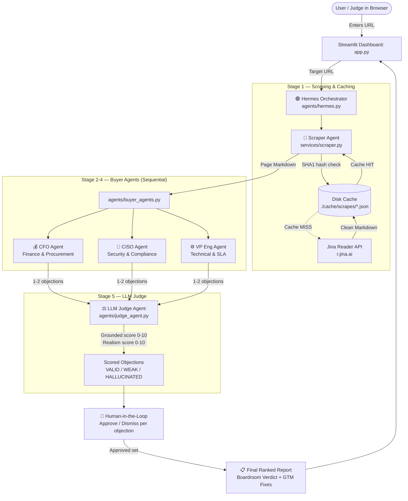

# 🧠 The Adversarial Buyer — Project Knowledge Base & Architecture Guide

> **Document Purpose:** Single source of truth for developers, contributors, and AI coding assistants to understand the full architecture, design principles, data contracts, agent roles, and workflows of **The Adversarial Buyer**.
>
> **Last Updated:** 2026-08-22 · Multi-agent refactor complete.

---

## 1. Executive Summary & Problem Statement

### 🎯 What is "The Adversarial Buyer"?

When SaaS companies sell software to enterprise organizations, deals are evaluated by a **hostile enterprise procurement committee** (CFO, CISO, VP of Engineering). Most enterprise deals are killed not in pitch meetings, but silently on the public pricing/landing page due to:
- Opaque or "Custom" pricing with no anchor
- Hidden annual minimums and lock-in clauses
- Security features gated behind expensive tiers (SSO tax)
- Vague "fair use" API throttle policies with no SLA commitment

**The Adversarial Buyer** is a **multi-agent AI system** that:
1. Scrapes any target SaaS pricing/landing page in real time.
2. Dispatches three separate hostile buyer AI agents (CFO, CISO, VP Eng) — each with a focused single-persona prompt.
3. Runs a fourth **LLM Judge agent** that scores every objection for groundedness and real-buyer realism.
4. Presents a **human-in-the-loop review panel** where the user approves or dismisses objections before the final report compiles.
5. Produces a strictly ranked, human-approved, judge-validated list of lethal objections with verbatim page citations and concrete GTM survival fixes.

### 📊 Success Metric
**Actionable deal-killing objections surfaced per pricing page audit, target ≥ 3.**
Each objection must be tied to a verbatim or near-verbatim quote from the actual page.

### 🎯 ICP
Head of Growth or VP of Sales at a Series A–B SaaS company (50–300 employees) transitioning from SMB/PLG to enterprise upmarket, actively losing deals at the security review or procurement redline stage.

---

## 2. Multi-Agent Architecture Diagram



---

## 3. Directory & File Structure

```text
adversarial-buyer/
│
├── app.py                      # Streamlit UI — 3-phase flow (pipeline / human review / report)
├── knowledge_base.md           # This file — architecture & engineering reference
├── requirements.txt            # Dependencies: httpx, streamlit, python-dotenv
├── .env                        # OPENROUTER_API_KEY (never committed)
├── .gitignore                  # Excludes .env, cache/, __pycache__
├── test_scraper.py             # Scraper + cache unit tests
├── test_llm.py                 # LLM connection + latency benchmark
│
├── agents/                     # ← NEW: multi-agent package
│   ├── __init__.py
│   ├── hermes.py               # Orchestrator: drives the full pipeline with status callbacks
│   ├── buyer_agents.py         # CFO, CISO, VP Eng — 3 separate focused LLM calls
│   └── judge_agent.py          # LLM Judge — scores groundedness & real-buyer realism
│
├── services/
│   ├── scraper.py              # Jina Reader scraper with SHA1 disk caching
│   ├── llm_analyzer.py         # Legacy single-call analyzer (kept for backwards compat)
│   └── openrouter_client.py    # ← NEW: shared httpx HTTP utility for all agents
│
└── cache/
    └── scrapes/                # {sha1_hash}.json — persisted page fetches
```

---

## 4. Agent Roles — Deep Dive

### 4.1. 🟣 Hermes — Orchestrator (`agents/hermes.py`)

Hermes is the **master controller**. It does no LLM reasoning itself. Its only job:
- Call each stage in order: Scraper → CFO → CISO → VP Eng → Judge
- Pass a `on_status(key, status, info)` callback to the UI so each agent's status updates live
- Collect all objections, sort by severity, and return a single structured result dict

**Key function:**
```python
run_pipeline(url, api_key=None, on_status=None) -> dict
```

**Return structure:**
```python
{
    "page_content": str,
    "from_cache": bool,
    "all_objections": list,      # all objections — valid first, then weak/hallucinated
    "valid_objections": list,    # judge-approved only
    "overall_damage_score": int, # avg severity of valid objections
    "timings": dict              # per-stage latency in seconds
}
```

**AGENT_META constant** (also in `hermes.py`) — used by the UI to render agent status cards in order.

---

### 4.2. 💰🔐⚙️ Buyer Agents (`agents/buyer_agents.py`)

Three focused adversarial agents. Each makes **one independent LLM call** with a tight single-persona system prompt. They run **sequentially** (not in parallel) to respect free-tier rate limits.

| Function | Persona | Attack Vectors |
|:---|:---|:---|
| `run_cfo_agent()` | CFO | Lock-in, hidden minimums, opaque unit costs, annual commitment traps |
| `run_ciso_agent()` | CISO | SSO tax, gated audit logs, vague SOC2, no data residency |
| `run_vpeng_agent()` | VP Eng | Fair-use throttle traps, missing SLA uptime, no rate limit numbers |

Each agent returns **1-2 objections maximum** — surgical, not exhaustive.

**Objection dict schema (per agent output):**
```json
{
  "persona": "Chief Financial Officer (CFO)",
  "domain": "Finance & Procurement",
  "severity_score": 92,
  "trigger_line": "exact verbatim quote from the page",
  "lethal_objection": "The ruthless buyer objection.",
  "gtm_vulnerability": "Why sales cannot defend this in a procurement meeting.",
  "gtm_survival_fix": "Exact change needed on the page to survive.",
  "agent": "cfo"
}
```

---

### 4.3. ⚖️ LLM Judge Agent (`agents/judge_agent.py`)

The **fact-checker agent**. Receives all buyer-agent objections + the original page content and scores each one independently.

**Scoring dimensions:**
- `grounded_score` (0–10): Is the `trigger_line` actually present on the page?
  - 9–10: Exact/near-verbatim match
  - 6–8: Clearly implied by real content
  - 0–5: Cannot find this on the page → **HALLUCINATED**
- `real_buyer_score` (0–10): Would a real CFO/CISO/VP Eng raise this?
  - 9–10: Classic procurement red flag
  - 6–8: Legitimate concern
  - 0–5: Theoretical / exaggerated → **WEAK**

**Verdict rules:**
- `grounded ≥ 6 AND real_buyer ≥ 6` → **VALID** ✅
- `grounded ≥ 6 AND real_buyer < 6` → **WEAK** ⚠️
- `grounded < 6` → **HALLUCINATED** ❌

**Why this matters for judges:** This is the direct technical answer to *"How do we know the AI isn't making things up?"* — a 4th separate AI call checks every claim against the actual page.

---

### 4.4. 🔵 Scraper Agent (`services/scraper.py`)

- **Engine:** Jina Reader (`https://r.jina.ai/{url}`)
- **Returns:** Clean plain-text Markdown
- **Caching:** SHA-1 hash of URL → `./cache/scrapes/{hash}.json`
- **Resilience:** 30s timeout, 1 automatic retry with 2s backoff
- **Cache payload:**
```json
{
  "url": "https://example.com/pricing",
  "fetched_at": "2026-08-22T07:16:41.979040+00:00",
  "content": "Title: Example Pricing..."
}
```

---

### 4.5. Shared HTTP Client (`services/openrouter_client.py`)

All agents use this single shared utility — no duplicated HTTP logic.

**Key functions:**
```python
call_openrouter(messages, model, api_key, timeout, temperature) -> str
parse_json_response(raw_str) -> Any   # strips markdown fences, parses JSON
```

**Default model:** `nvidia/nemotron-3.5-lightning:free`
**Fallback chain:** `dots-studio/dots-3-note-preview:free` → `liquid/lfm-2.5-2.6b:free`

---

## 5. Streamlit UI — 3-Phase Flow (`app.py`)

The UI is driven entirely by `st.session_state`. Three phases render in sequence:

### Phase 1 — Agent Pipeline Panel
Live status per agent using `st.empty()` placeholders. As each agent completes, its card updates from 🟡 Running → ✅ Done with elapsed time and output count.

### Phase 2 — Human-in-the-Loop Review
Renders after the pipeline completes (before the final report). Shows each objection with:
- Judge's verdict badge (VALID / WEAK / HALLUCINATED)
- Grounded score and Realism score
- Pre-checked if VALID, pre-unchecked if WEAK or HALLUCINATED
- User can override any checkbox
- "Compile Final Report" button triggers `st.rerun()` into Phase 3

### Phase 3 — Final Ranked Report
Only human-approved objections appear. Re-ranked by severity. Each card shows:
- Rank badge (LETHAL DEAL KILLER / CRITICAL BLOCKER / PROCUREMENT GATE)
- Persona, domain, severity score
- Judge scores (colour-coded green/amber)
- Exact trigger line (`st.error`)
- Lethal objection, GTM vulnerability, GTM survival fix (`st.success`)
- "Re-run Human Review" and "Scan New URL" buttons

**Inspector Tabs (always visible after scan):**
| Tab | Contents |
|:---|:---|
| 🌐 Scraped DOM | Raw Jina markdown + cache file path |
| 🤖 Raw Agent Output | Full JSON from all buyer agents |
| ⚖️ Judge Scores | Dataframe: agent, grounded, realism, verdict, reasoning |
| 📋 Export Brief | Copy-paste markdown report |

---

## 6. Session State Keys

| Key | Type | Purpose |
|:---|:---|:---|
| `pipeline_result` | `dict \| None` | Full Hermes output. `None` = not yet run |
| `scanned_url` | `str` | URL of last scan (used to detect URL change) |
| `agent_states` | `dict` | Per-agent status + info for replaying the pipeline panel |
| `approved_indices` | `list[int] \| None` | Human-approved objection indices. `None` = not yet reviewed |

---

## 7. Local Setup & Execution

### Prerequisites
- Python 3.10+
- OpenRouter API Key (free tier works)

### Installation
```powershell
git clone https://github.com/Satyam6024/b5-the-adversarial-buyer.git
cd b5-the-adversarial-buyer
pip install -r requirements.txt
```

### Add API Key
Create `.env` in the project root:
```
OPENROUTER_API_KEY=sk-or-v1-xxxxxxxxxxxxxxxx
```

### Run
```powershell
streamlit run app.py
```

### Verification Tests
```powershell
python test_scraper.py   # Scraper + disk cache
python test_llm.py       # OpenRouter connection + latency
```

---

## 8. Submission Fields (Hackathon)

| Field | Value |
|:---|:---|
| **ICP** | Head of Growth / VP Sales at Series A–B SaaS (50–300 employees) transitioning to enterprise, losing deals at procurement/security review |
| **Hypothesis** | Enterprise deals are lost on the pricing page, not in the demo. CFOs need a budget anchor before opening negotiations. |
| **Channel** | Founder-to-founder on X/Twitter + LinkedIn via public pricing teardown posts; GTM Slack communities (RevGenius, Exit Five) |
| **Conversion Path** | See post → paste own URL → get personalized audit → hit paywall for full fix report → email capture |
| **Success Metric** | **Actionable deal-killing objections per audit ≥ 3** (each cited from a verbatim page line) |

---

## 9. Guidelines for Future Developers & AI Agents

1. **Do NOT collapse the 3 buyer agents back into 1 LLM call.** The separation is intentional — each persona needs its own focused context window and system prompt to avoid persona bleed.

2. **Do NOT remove the LLM Judge.** It is the direct answer to the "how do we know the AI is telling the truth?" objection from judges and enterprise buyers alike.

3. **Do NOT remove `trigger_line` from the prompt schema.** The core rule: every objection must cite the exact line on the page. This is what separates real analysis from generic AI hallucination.

4. **Preserve `on_status` callback pattern in Hermes.** This is how the UI gets live updates. Do not make Hermes block the UI thread with print statements.

5. **Keep `services/openrouter_client.py` as the single HTTP utility.** Never re-implement the model fallback loop inside individual agents.

6. **Never commit `.env` or `./cache/`.** Verify `.gitignore` is respected before every push.

7. **Pre-run demo URLs before any live presentation.** The scraper cache means a second scan of the same URL returns in < 1s. Always pre-warm `vercel.com/pricing`, `linear.app/pricing`, and `github.com/pricing` before a demo.
